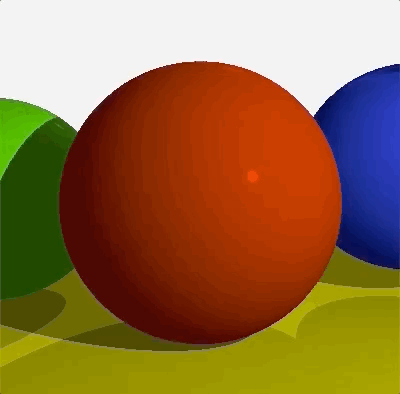

# My First OF Project
## _My First Raytracer_

This was made by following along with [Gabriel Gambetta](https://www.gabrielgambetta.com/)'s [Raytracing tutorial](https://www.gabrielgambetta.com/computer-graphics-from-scratch/raytracing.html) which is part of [Computer Graphics From Scratch](https://www.gabrielgambetta.com/computer-graphics-from-scratch/introduction.html).



The tutorial is written in somewhere-between JavaScript and psuedocode, but generally the main functions appear like so:

```javascript
// Gambatta's tutorial code:
IntersectRaySphere(O, D, sphere) {
    C = sphere.center
    r = sphere.radius
    oc = O - C

    k1 = dot(D, D)
    k2 = 2*dot(OC, D)
    k3 = dot(OC, OC) - r*r

    discriminant = k2*k2 - 4*k1*k3
    if discriminant < 0:
        return inf, inf

    t1 = (-k2 + sqrt(discriminant)) / (2*k1)
    t2 = (-k2 - sqrt(discriminant)) / (2*k1)
    return t1, t2
}
```

So the exercise for myself was to write a functioning raytracer but try to make use of C++ and OpenFrameworks functionality. The above function is a good example of a conversion as there's some passing by reference in there, and it's the first time I've ever returned a `double*` to a `static double` array created inside a function. Whether that's good practice or not I don't know yet:

```c
double* ofApp::intersectRaySphere(glm::vec3 o, glm::vec3 Dir, const Sphere& sphere){
    vec3 C = sphere.centre;
    double r = sphere.r;
    vec3 oc = o - C;

    double k1 = dot(Dir, Dir);
    double k2 = 2*dot(oc, Dir);
    double k3 = dot(oc, oc) - r*r;

    double discriminant = k2*k2 - 4*k1*k3;

    static double ret[2];

    if(discriminant < 0) {
        ret[0] = INFINITY;
        ret[1] = INFINITY;
        return ret;
    }

    double t1 = (-k2 + sqrt(discriminant)) / (2*k1);
    double t2 = (-k2 - sqrt(discriminant)) / (2*k1);

    ret[0] = t1;
    ret[1] = t2;

    return ret;
}
```

OF was mostly used to access GLM classes and functionality, and also to create a window and a texture to create the image/animation. 

```c
void ofApp::setup(){
    ticks = 0;
    Cw = ofGetWidth();
    Ch = ofGetHeight();
    Vw = Vh = d = 1;

    data = new unsigned char[Cw * Ch* 3];
    tex.allocate(Cw, Ch, GL_RGB);

    nTotalBytes = Cw * Ch * 3;

    o = vec3(0.0, 0.0, 0.0);

    bg = ofColor(240, 240, 240);

    makeSpheres();
    makeLights();
}
```

I found the tutorial to be fantastic. I sped through it a little to quickly to get something working so could do with reading it more thoroughly, but I would recommend it as an intro to raytracing. It was also a good exercise in C++ as I played with structs for simple data structures and even pointers at times. I made and effort to use C++ specifics where ever possible - like using iterators in `for` loops:

```c
for(vector<Sphere>::const_iterator it=spheres.begin(); it!=spheres.end(); ++it){
    double* t = intersectRaySphere(o, Dir, *it); 
    if((t[0] > t_min && t[0] > t_max) && t[0] < closest_t){
        closest_t = t[0];
        closest_sphere = *it;
    }
    if((t[1] > t_min && t[1] < t_max) && t[1] < closest_t){
        closest_t = t[1];
        closest_sphere = *it;
    }
}
```

---

## To Run:

The project was created with `of_v20200123_osx_release` but there is no reason why it shouldn't run with most OF releases - it doesn't have too many dependencies within OF. Although I understand OF [changed the way you interface with GLM](https://openframeworks.cc/learning/02_graphics/how_to_use_glm/) at some point in the last 5 years maybe..?

Downloading the project into your OpenFrameworks `/myApps` folder and running `make` to compile, and then `make RunRelease` to run the program. You should see the looping animation as per the GIF above.
